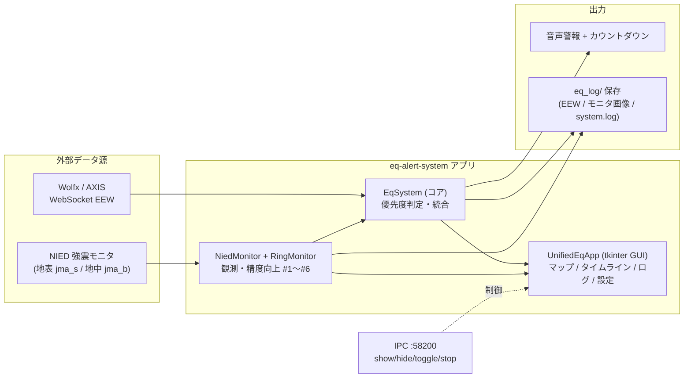

# eq-alert-system — 地震通知システム

Raspberry Pi 向けのリアルタイム地震通知システム。EEW（緊急地震速報）と NIED（防災科研）強震モニタ画像を統合し、tkinter GUI 上で地図・タイムライン表示と S 波到達カウントダウン音声を提供する。

## 概要

- **EEW 受信**: WebSocket 経由で速報を受信し、震源・予測震度・S 波到達時刻を取得
- **NIED 強震モニタ監視**: リアルタイムモニタ画像を解析し、地表（jma_s）・地中（jma_b）の観測震度を取得
- **統合警報**: EEW 予測と実測を突き合わせ、優先度付きで音声警報を再生（S 波到達 60/45/30/20/15/5/4/3 秒前のカウントダウン含む）
- **GUI**: 地図（Full/Crop）、EEW 更新タイムライン、ログビューア、過去ログ再生シミュレーション、設定画面

精度向上の改良ロードマップ（#1 地中 AND ノイズ排除 〜 #9）を段階的に実装中。詳細は [eq_src/README.md](eq_src/README.md) を参照。

## システム構成（高レベル）



コンポーネント単位の詳細図・処理フロー図は [eq_src/README.md](eq_src/README.md) を参照。

## ディレクトリ構成

| ディレクトリ | 内容 |
| --- | --- |
| [eq_src/](eq_src/) | アプリケーション本体のソースコード（GUI・システムコア・監視・音声） |
| [eq_config/](eq_config/) | 設定モジュールと `eq_settings.json`（ホットリロード対応） |
| [eq_assets/](eq_assets/) | 音声合成用の WAV アセット（地域名・震度・カウントダウン等） |
| [eq_test/](eq_test/) | ユニットテスト・シミュレーション・精度評価・前処理スクリプト |
| [eq_log/](eq_log/) | 実行時ログ・EEW ログ・モニタ画像の保存先 |
| [eq_src_backup/](eq_src_backup/) | 過去の `eq_src` スナップショット（参照用アーカイブ） |
| [eq_app4win/](eq_app4win/) | Windows 向け PyInstaller ビルド用ミラー（配布バイナリ生成） |

## 初回セットアップ

個人環境設定（自宅座標・SSDパス・AXIS認証トークン等）は git 管理外。初回のみ以下をコピーして値を書き換える。

```bash
cp eq_config/eq_config_local.py.example eq_config/eq_config_local.py
cp eq_src/token.json.example eq_src/token.json
```

詳細は [eq_config/README.md](eq_config/README.md) を参照。

## 実行方法

### Raspberry Pi / Linux

```bash
# 直接起動
python3 eq_src/eq_app.py

# ランチャースクリプト経由（ログを eq_app_launch.log に tee 出力）
./run_eq_app.sh

# 自動起動セットアップ（systemd / autostart）
./setup_autostart.sh
```

### Windows

[eq_app4win/README.md](eq_app4win/README.md) を参照（`run.bat` で直接実行、`build_exe.bat` で exe 化）。

## 依存パッケージ

`pygame` / `Pillow` / `websocket-client` / `numpy` / `requests`（バージョンは [eq_app4win/requirements.txt](eq_app4win/requirements.txt) 参照）。

## シングルインスタンス管理（IPC）

ポート `58200` で単一インスタンスを保証。外部コマンド `show` / `hide` / `toggle` / `stop` を受け付ける。ウィンドウの×ボタンは `withdraw()`（非表示）のみで完全終了しない。

## ルート直下のファイル

- `run_eq_app.sh` — Linux 用起動ランチャー
- `setup_autostart.sh` — Raspberry Pi 自動起動セットアップ
- `patch_eq_monitor.py` — `eq_monitor_nied.py` への一括パッチ適用スクリプト（開発用ワンショット）
- `.gitignore`
