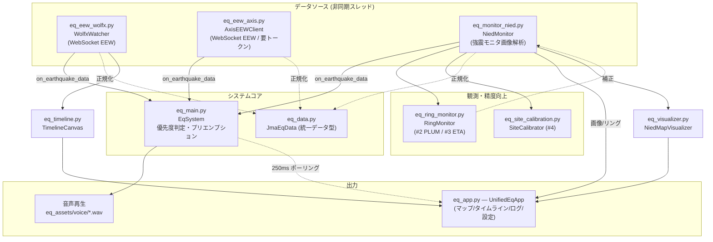
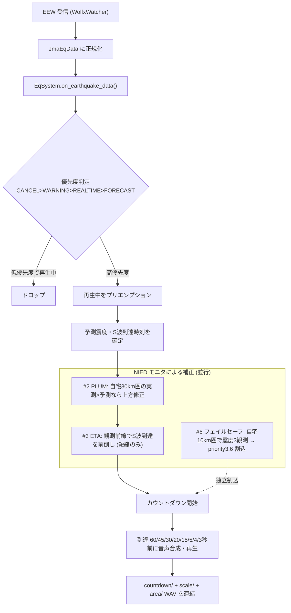
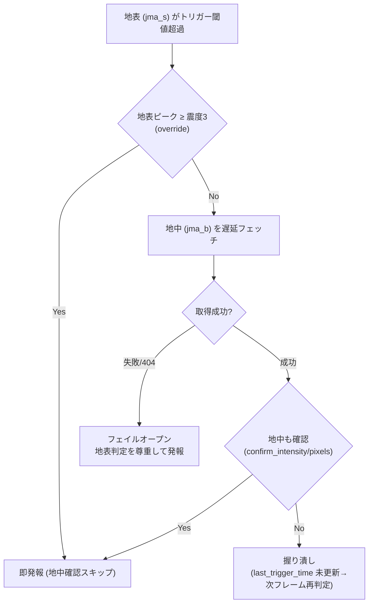
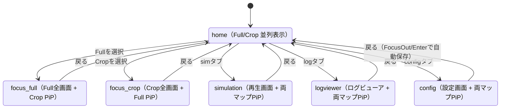

# eq_src — アプリケーション本体

地震通知システムのソースコード一式。GUI・システムコア・EEW 受信・NIED 監視・音声再生・可視化を担う。

## アーキテクチャ

データソース（EEW / NIED モニタ）が非同期に `EqSystem`（コア）へイベントを送り、コアが優先度判定して音声再生と GUI 更新を駆動する。GUI（`UnifiedEqApp`）はコアをポーリングして表示を更新する。

## 処理フロー（EEW 受信 → 警報）

EEW 受信から S 波到達カウントダウンまでの主経路。NIED 監視による精度向上策（#1〜#6）が予測・発報にどこで介入するかを示す。

### NIED 発報ゲート（#1 地中 AND）

強震モニタ由来の発報は、地表トリガー時に地中を確認する二段ゲートを通る。

## モジュール構成

### コア

| ファイル | 役割 |
| --- | --- |
| `eq_app.py` | メイン GUI（`UnifiedEqApp`）。マップ表示・タブUI・PiP・シミュレーション画面・設定画面。エントリポイント |
| `eq_gui_main.py` | 監視/可視化を単体で動かす軽量 GUI（`NiedMonitor` + `NiedMapVisualizer` の開発・デバッグ用） |
| `eq_main.py` | システムコア（`EqSystem`）。各データソースのコールバック統合、優先度判定、音声再生の制御 |
| `eq_data.py` | 統一データ型（`JmaEqData` / `EqSource` / `EqType`）。全ソースをこの型に正規化 |
| `eq_utils.py` | ロガー（`EqLogger`）等の共通ユーティリティ |

### EEW 受信

| ファイル | 役割 |
| --- | --- |
| `eq_eew_wolfx.py` | Wolfx WebSocket からの EEW 受信（`WolfxWatcher`）。本番の主データソース |
| `eq_eew_axis.py` | AXIS（prioris）WebSocket からの EEW 受信（`AxisEEWClient`）。トークン認証が必要 |
| `eq_axis_token_manager.py` | AXIS アクセストークンの取得・更新（`TokenManager`、`token.json` を管理） |
| `eq_axis_logger_config.py` | AXIS 系モジュール用のロガー初期化（`../eq_log/` へ日次ローテーション出力） |
| `eq_axis_test_runner.py` | AXIS クライアントをモックシナリオで駆動する検証ランナー |

### NIED 強震モニタ監視・精度向上

| ファイル | 役割 |
| --- | --- |
| `eq_monitor_nied.py` | NIED リアルタイムモニタ画像の取得・解析（`NiedMonitor`）。地表/地中トリガー判定、精度向上策 #1〜#7 のライブ配線 |
| `eq_ring_monitor.py` | リング観測コア（`RingMonitor`）。ピクセル→緯度経度逆変換 + Haversine で自宅同心円圏の観測最大震度を算出（#2 PLUM / #3 ETA） |
| `eq_site_calibration.py` | サイト地盤増幅の実測較正（`SiteCalibrator`）。最寄り地中局で「地表−地中」を蓄積（#4、記録のみ・予測へ未適用） |
| `eq_visualizer.py` | 地図描画（`NiedMapVisualizer`）。モニタ画像・震源・リング・予測を重畳表示 |
| `eq_timeline.py` | EEW 更新履歴のタイムライン描画（`TimelineCanvas`） |
| `eq_monitor_card.py` | monitor タブのシステムログ上端に重ねる地震情報カード（`MonitorLogCardStack`）。アラート期間終了時に出現、LIFO スタックで最新1件を表示 |

### 開発補助

| ファイル | 役割 |
| --- | --- |
| `eq_test_nied_gif_gen.py` | 監視画像から GIF を生成する開発用スクリプト |
| `test_eq_axis_scenario*.json` | `eq_axis_test_runner.py` 用のモックシナリオ（デフォルト / 関東 / 宮城） |
| `token.json` | AXIS 認証トークンの永続化ファイル。`.gitignore` 対象（git管理外）。`token.json.example` をコピーして作成 |

## GUI ステート機械（eq_app.py）

`home` を起点に各画面へ遷移。`focus_*` は片側マップを全画面化し他方を PiP 表示、`simulation`/`logviewer`/`config` は各画面 + 両マップを PiP 表示する。PiP はドラッグ可能（AABB 衝突回避付き）。

## タブ構成

1. **monitor** — 稼働表示 + システムログ（250ms ポーリング）。新規に記録された地震はシステムログ上端に地震カード（日時 / 震源 / 最大 + [確認] / [x]）を重ねて表示（`eq_monitor_card.py`）。NIED アラート期間終了時に出現し、[確認] で log タブの該当イベントへ遷移、ログ「クリア」で全カード消去
2. **log** — 地震イベント一覧 + EEW JSON / NIED 画像 / GIF / MP4 ビューア
3. **sim** — 過去ログ再生シミュレーション（stdout/stderr を GUI にリダイレクト）
4. **config** — FocusOut/Enter で自動保存

## コールバックフロー

`WolfxWatcher` / `NiedMonitor` → `EqSystem.on_earthquake_data()` → 優先度判定 → 音声再生（プリエンプション/ドロップ）。

優先度: **CANCEL(4.0) > WARNING(3.0) > REALTIME(2.0) > FORECAST(1.0)**（シミュレーションは −10.0 オフセット）。到達確定フェイルセーフ（#6）は priority 3.6 で割り込む。

## 精度向上ロードマップ（実装状況）

- **#1 地中 AND ノイズ排除** — 完了。地表トリガー時のみ地中を取得し確認（フェイルオープン／震度3以上は override で即発報）
- **#2 疑似 PLUM 上方修正** — 完了。自宅30km圏の実測最大がEEW予測を上回れば上方修正
- **#3 S波到達ETA補正（短縮のみ）** — 完了。観測前線でカウントダウンを前倒し（安全側）
- **#4 サイト地盤増幅較正** — 完了（記録のみ・予測へ未適用）
- **#5 経路バイアス補正** — 保留（自宅近傍に地中局が無く安全に実装不可）
- **#6 到達確定フェイルセーフ** — 完了。観測実揺れで独立警報
- **#7 予測精度評価ハーネス** — 完了（[eq_test/](../eq_test/) の `eval_prediction_accuracy.py`）
- #8 差分可視化 / #9 ML — 未着手

設定値は [eq_config/eq_settings.json](../eq_config/eq_settings.json)、テストは [eq_test/](../eq_test/) を参照。
